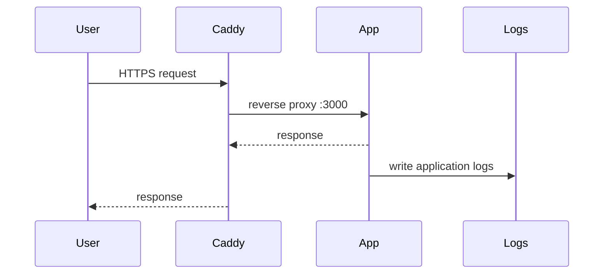

# Node.js App (service `app`)

> Cập nhật tham chiếu: 2026-03-31 (theo cấu hình repo hiện tại + thực hành Node.js container production).

## 1) App trong `docker-compose.yml` hiện tại

- Build từ `./services/app`.
- Env:
  - `NODE_ENV` (default production)
  - `PORT` (default 3000)
  - `LOG_DIR` (default `/app/logs`)
- Mount logs: `./logs/app:/app/logs`.
- Route qua Caddy bằng labels.

## 2) Dịch vụ app hỗ trợ những phần gì?

Tùy code app, nhưng theo mô hình hiện tại app thường đảm nhiệm:
- API/business logic chính.
- Logging ra file mount để Dozzle/Filebrowser quan sát.
- Health endpoint (nên có) để proxy kiểm tra.
- Config qua env để tách code với môi trường.

## 3) Cấu hình nên bổ sung để tối ưu

### 3.1 Healthcheck

Trong compose:

```yaml
healthcheck:
  test: ["CMD", "wget", "-qO-", "http://localhost:3000/health"]
  interval: 10s
  timeout: 3s
  retries: 5
```

### 3.2 Resource limits

```yaml
deploy:
  resources:
    limits:
      cpus: '1.00'
      memory: 512M
```

> Nếu không dùng Swarm, có thể dùng `mem_limit`/`cpus` theo runtime tương ứng.

### 3.3 Graceful shutdown

- Bắt `SIGTERM` trong Node.js để đóng server/connection trước khi dừng container.
- Tránh mất request khi rolling restart.

### 3.4 Logging chuẩn JSON

- Log JSON để dễ parse/alert.
- Định nghĩa level `info/warn/error` rõ ràng.

### 3.5 Bảo mật

- Chạy non-root user trong Dockerfile.
- Không expose secrets qua log/env plaintext.
- Bật dependency scan định kỳ.

## 4) Ứng dụng thực tế

- API backend cho web/mobile.
- Internal webhook receiver.
- Service nền xử lý tác vụ theo lịch (kết hợp queue).

## 5) Diagram luồng hoạt động



## 6) Checklist production

- Có `/health` và `/ready`.
- Graceful shutdown.
- Limits CPU/RAM.
- Log JSON + retention policy.
- Theo dõi lỗi 5xx, latency, saturation.

## 7) Tài liệu tham khảo chính thức

- Dockerizing Node.js: https://docs.docker.com/guides/nodejs/
- Node.js best practices (general): https://nodejs.org/en/docs/
