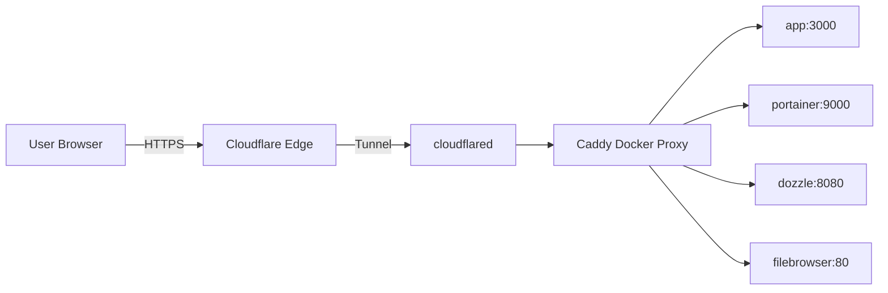

# Caddy (lucaslorentz/caddy-docker-proxy)

> Cập nhật tham chiếu: 2026-03-31 (đối chiếu theo tài liệu Caddy + `lucaslorentz/caddy-docker-proxy`).

## 1) Caddy trong `docker-compose.yml` hiện tại

- Image: `lucaslorentz/caddy-docker-proxy:ci-alpine`.
- Mở cổng: `80`, `443`.
- Mount Docker socket read-only để tự đọc labels container.
- Dùng volume `caddy_data`, `caddy_config` để lưu state/cert config.
- Biến `CADDY_INGRESS_NETWORKS=app_net` để Caddy chỉ route vào network nội bộ.
- Label global:
  - `caddy.email=${CADDY_EMAIL}`.
  - `caddy.auto_https="off"`.

## 2) Dịch vụ này hỗ trợ gì?

### 2.1 Reverse proxy động theo Docker labels

Bạn khai báo labels ở từng service backend (`app`, `portainer`, `dozzle`, `filebrowser`), Caddy tự sinh cấu hình route.

Ví dụ trong compose hiện tại:
- `caddy=http://sub.domain`
- `caddy.reverse_proxy={{upstreams 3000}}`

### 2.2 Hỗ trợ Caddy directives gần như đầy đủ qua labels

Bạn có thể map nhiều directive quan trọng:
- `reverse_proxy` (load balancing, health check, header, retry...)
- `encode` (gzip/zstd)
- `header`
- `rate_limit` (nếu module có)
- `basic_auth`
- `tls` (nội bộ hoặc public cert)
- `handle`, `handle_path`, `route` để chia flow

### 2.3 Tự động HTTPS

- Với Caddy thuần, HTTPS tự động khi domain public + DNS đúng.
- Ở stack này bạn đang tắt `auto_https` (do đi qua Cloudflare Tunnel), nên cần chủ động quyết định nơi terminate TLS.

### 2.4 Observability & vận hành

- Có thể bật `log` ở site-level.
- Có thể bật `admin API` (nên khóa mạng nội bộ).
- Hỗ trợ reload config động khi container thay đổi labels.

## 3) Cấu hình quan trọng để tối ưu

### 3.1 Đổi tag image ổn định

Hiện dùng `ci-alpine` (có tính thử nghiệm). Với production nên pin version cụ thể, ví dụ:
- `lucaslorentz/caddy-docker-proxy:2.9.1-alpine` (ví dụ minh họa, chọn version stable thực tế).

### 3.2 Bật Basic Auth cho route nhạy cảm

Trong compose đã có comment sẵn. Cách làm:

1. Sinh hash mật khẩu (BCrypt) bằng Caddy:

```bash
caddy hash-password --plaintext 'MatKhauManh'
```

2. Khai báo env:

```env
CADDY_AUTH_USER=admin
CADDY_AUTH_HASH=$2a$14$....
```

3. Mở labels ở service cần bảo vệ (ví dụ Dozzle/Filebrowser/App):

```yaml
labels:
  - "caddy=http://logs-my-docker-app.example.com"
  - "caddy.reverse_proxy={{upstreams 8080}}"
  - "caddy.basic_auth=/*"
  - "caddy.basic_auth.${CADDY_AUTH_USER}=${CADDY_AUTH_HASH}"
```

> Lưu ý: Basic Auth nên kết hợp allowlist IP/VPN (Tailscale) vì chỉ user/pass thôi chưa đủ cho admin endpoint.

### 3.3 Bổ sung hardening headers

Ví dụ labels:

```yaml
- "caddy.header.Strict-Transport-Security=max-age=31536000; includeSubDomains; preload"
- "caddy.header.X-Frame-Options=DENY"
- "caddy.header.X-Content-Type-Options=nosniff"
- "caddy.header.Referrer-Policy=no-referrer"
```

### 3.4 Health-check & retry upstream

```yaml
- "caddy.reverse_proxy={{upstreams 3000}}"
- "caddy.reverse_proxy.health_uri=/health"
- "caddy.reverse_proxy.health_interval=10s"
- "caddy.reverse_proxy.lb_try_duration=5s"
```

### 3.5 Logging rõ ràng theo từng site

```yaml
- "caddy.log.output=file /data/access-app.log"
- "caddy.log.format=json"
```

## 4) Ứng dụng thực tế

- Làm API gateway nhẹ cho microservices Docker.
- Front cho dashboard nội bộ (Portainer/Dozzle/Filebrowser).
- Reverse proxy cho app web internal với Cloudflare Tunnel hoặc VPN-only.

## 5) Diagram luồng hoạt động



## 6) Checklist triển khai production

- Pin image version, tránh `latest`/`ci`.
- Bật auth cho dashboard admin.
- Tách domain public và domain internal.
- Định nghĩa `/health` cho từng backend.
- Log JSON + rotate log.
- Backup `caddy_data` định kỳ.

## 7) Tài liệu tham khảo chính thức

- Caddy Docker Proxy: https://github.com/lucaslorentz/caddy-docker-proxy
- Caddy directives: https://caddyserver.com/docs/
- `reverse_proxy`: https://caddyserver.com/docs/caddyfile/directives/reverse_proxy
- `basic_auth`: https://caddyserver.com/docs/caddyfile/directives/basic_auth
