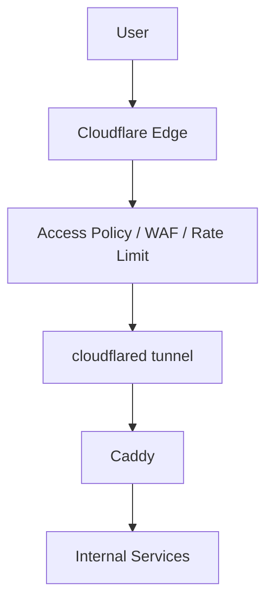

# Cloudflared (Cloudflare Tunnel)

> Cập nhật tham chiếu: 2026-03-31 (đối chiếu tài liệu Cloudflare Tunnel).

## 1) Cloudflared trong `docker-compose.yml` hiện tại

- Image: `cloudflare/cloudflared:latest`.
- Command: `tunnel --config /etc/cloudflared/config.yml run`.
- Mount:
  - `./cloudflared/config.yml`
  - `./cloudflared-credentials.json`
- Cùng network `app_net`, phụ thuộc `caddy`.

## 2) Dịch vụ này hỗ trợ gì?

- Expose dịch vụ nội bộ ra Internet **không cần mở inbound port** trên router/server.
- Mã hóa traffic từ edge Cloudflare về origin (tunnel).
- Route theo hostname/path tới origin nội bộ (vd Caddy).
- Hỗ trợ HA với nhiều replica cloudflared cùng 1 tunnel.
- Kết hợp Access policies (Zero Trust) để bắt login SSO/MFA trước khi vào app.

## 3) Cấu hình quan trọng nên tối ưu

### 3.1 Tránh `latest`

Pin version cụ thể để ổn định triển khai/rollback.

### 3.2 Kiểm soát ingress rules

Trong `cloudflared/config.yml` nên có rule rõ ràng:
- hostname chính map về `http://caddy:80`
- default fallback `http_status:404`

### 3.3 Bảo mật credentials

- `cloudflared-credentials.json` phải chmod chặt.
- Không commit lên git.
- Nên rotate token/credentials định kỳ.

### 3.4 Tối ưu độ tin cậy

- Chạy từ 2 replica trở lên (khác host nếu có thể).
- Giám sát reconnect, latency, lỗi DNS/origin.

### 3.5 Kết hợp Cloudflare Access

- Dashboard admin (Portainer/Dozzle/Filebrowser) nên bắt login Access (Google/Microsoft/GitHub IdP) + MFA.
- Có thể theo nhóm email/domain/team.

## 4) Ứng dụng thực tế

- Public nhanh môi trường staging mà không mở port public.
- Publish dashboard nội bộ nhưng có cổng kiểm soát Access.
- Truy cập service sau NAT/CGNAT.

## 5) Diagram luồng hoạt động

## 6) Checklist production

- Pin image version.
- Access policy cho từng hostname admin.
- Fallback 404 rõ ràng.
- Bật alert khi tunnel down.
- Không để lộ file credentials.

## 7) Tài liệu tham khảo chính thức

- Cloudflare Tunnel: https://developers.cloudflare.com/cloudflare-one/connections/connect-networks/
- cloudflared (Docker): https://developers.cloudflare.com/cloudflare-one/connections/connect-networks/do-more-with-tunnels/local-management/as-a-service/docker/
- Zero Trust Access: https://developers.cloudflare.com/cloudflare-one/policies/access/
