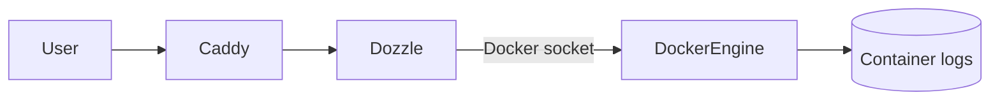

# Dozzle (real-time container logs)

> Cập nhật tham chiếu: 2026-03-31 (đối chiếu tài liệu Dozzle).

## 1) Dozzle trong `docker-compose.yml` hiện tại

- Image: `amir20/dozzle:latest`.
- Mount Docker socket read-only.
- Route qua Caddy tới `8080`.
- Chưa bật xác thực riêng trong service.

## 2) Dozzle hỗ trợ gì?

- Xem log realtime cho container Docker qua web UI.
- Tìm kiếm/lọc log theo service/container.
- Theo dõi nhanh lỗi runtime mà không cần SSH.
- Dễ dùng cho môi trường dev/staging.

## 3) Cấu hình nên tối ưu

### 3.1 Bảo mật truy cập

- Không nên public mở.
- Có thể bảo vệ bằng:
  - Caddy Basic Auth.
  - Cloudflare Access.
  - Chỉ cho truy cập qua Tailscale.

### 3.2 Pin image version

- Tránh `latest` để ổn định.

### 3.3 Giảm phạm vi hiển thị (nếu nhu cầu)

- Chỉ show logs của nhóm container nhất định (tuỳ biến theo config Dozzle).

### 3.4 Kết hợp hệ thống log tập trung

- Dozzle tốt cho realtime troubleshooting.
- Với production lớn nên thêm Loki/ELK/OpenSearch để lưu trữ & truy vấn dài hạn.

## 4) Ứng dụng thực tế

- Debug nhanh sự cố 5xx/timeouts.
- Theo dõi log deploy mới.
- Hỗ trợ đội dev tự tra cứu lỗi service.

## 5) Diagram luồng hoạt động

## 6) Checklist production

- Bật lớp xác thực ngoài (Access/VPN/Auth).
- Pin version.
- Không dùng như hệ thống log lưu trữ dài hạn.
- Kết hợp alert từ stack observability chính.

## 7) Tài liệu tham khảo chính thức

- Dozzle docs: https://dozzle.dev/
- Getting started: https://dozzle.dev/guide/getting-started
- Security guidance: https://dozzle.dev/guide/authentication
