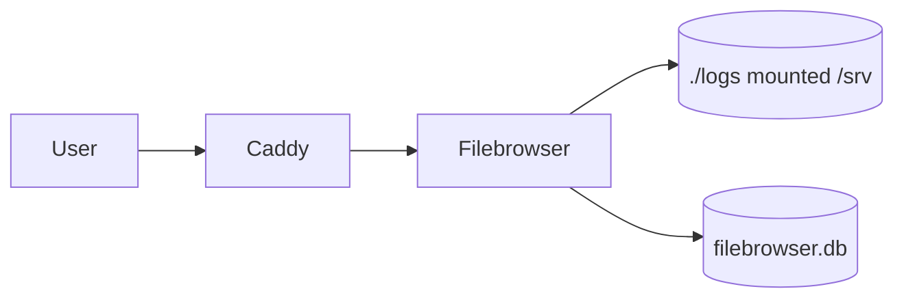

# Filebrowser

> Cập nhật tham chiếu: 2026-03-31 (đối chiếu tài liệu Filebrowser).

## 1) Filebrowser trong `docker-compose.yml` hiện tại

- Image: `filebrowser/filebrowser:latest`.
- Command:
  - `--noauth`
  - `--port 80`
  - `--root /srv`
  - `--database /database/filebrowser.db`
- Mount:
  - `./logs:/srv`
  - `filebrowser_data:/database`
- Route qua Caddy.

## 2) Filebrowser hỗ trợ gì?

- Duyệt file/thư mục qua web.
- Upload/download/xóa/đổi tên file.
- Quản lý user/quyền (khi bật auth).
- Chia sẻ nhanh file nội bộ cho team.

## 3) Điểm cần lưu ý với cấu hình hiện tại

Hiện bạn dùng `--noauth` => ai vào được URL là xem/sửa file được.
Đây là rủi ro lớn nếu public Internet.

## 4) Cấu hình đề xuất để an toàn hơn

### 4.1 Bật authentication của Filebrowser

- Bỏ `--noauth`.
- Tạo admin user ban đầu.
- Giới hạn quyền theo user/group.

### 4.2 Giới hạn phạm vi thư mục

- Chỉ mount đúng thư mục cần chia sẻ (`./logs` là hợp lý).
- Tránh mount root hoặc thư mục chứa secrets.

### 4.3 Bổ sung bảo vệ lớp ngoài

- Caddy Basic Auth hoặc Cloudflare Access.
- Ưu tiên chỉ cho truy cập qua Tailscale khi dùng nội bộ.

### 4.4 Pin version + backup DB

- Pin image version cụ thể.
- Backup `filebrowser.db` định kỳ để giữ user/quyền.

## 5) Ứng dụng thực tế

- Ops tải log từ server qua web.
- Team QA tải artifact/test report.
- Chia sẻ tệp nội bộ nhanh không cần FTP/SFTP cho user không kỹ thuật.

## 6) Diagram luồng hoạt động

## 7) Checklist production

- Bỏ `--noauth`.
- Tạo user role-based.
- Chỉ mount thư mục tối thiểu cần thiết.
- Backup DB quyền truy cập.
- Đặt policy truy cập theo VPN/Access.

## 8) Tài liệu tham khảo chính thức

- Filebrowser docs: https://filebrowser.org/
- Filebrowser configuration: https://filebrowser.org/configuration
- Filebrowser CLI options: https://filebrowser.org/cli/filebrowser
