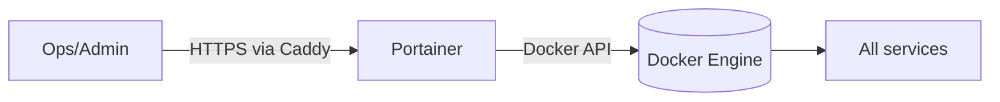

# Portainer CE

> Cập nhật tham chiếu: 2026-03-31 (đối chiếu tài liệu Portainer CE).

## 1) Portainer trong `docker-compose.yml` hiện tại

- Image: `portainer/portainer-ce:latest`.
- Mount Docker socket read-only.
- Persist data ở volume `portainer_data:/data`.
- Route qua Caddy vào port `9000`.

## 2) Portainer hỗ trợ gì?

- UI quản trị Docker: containers, images, networks, volumes.
- Quản lý stack (Compose) qua giao diện.
- Quản lý users/teams/roles cho quyền truy cập.
- Template/app catalog (tuỳ phiên bản).
- Endpoint management: local + remote environments (agent/edge).

## 3) Cấu hình nên tối ưu

### 3.1 Bảo mật đăng nhập

- Bắt buộc mật khẩu admin mạnh + MFA (nếu edition hỗ trợ).
- Không public thẳng mà không lớp bảo vệ.
- Nên thêm Cloudflare Access/Tailscale cho endpoint admin.

### 3.2 Socket mount an toàn

- Dù mount read-only, Portainer vẫn là bề mặt quản trị nhạy cảm.
- Cần coi Portainer là “high-privilege app”.

### 3.3 Backup dữ liệu Portainer

- Backup volume `/data` định kỳ để giữ user, endpoint, stack metadata.

### 3.4 Pin version

- Tránh `latest`, pin version stable để tránh breaking changes.

### 3.5 RBAC

- Tạo team theo môi trường (`dev`, `staging`, `prod`).
- Giới hạn ai được deploy/chỉnh stack production.

## 4) Ứng dụng thực tế

- Vận hành nhanh stack Docker cho team nhỏ/trung.
- Delegation cho dev tự restart/check log mà không cần SSH host.
- Quản lý multi-host nếu có agent.

## 5) Diagram luồng hoạt động

## 6) Checklist production

- Pin version cụ thể.
- Bảo vệ bằng Access/VPN.
- Bật principle of least privilege (RBAC).
- Backup `portainer_data`.
- Audit user actions định kỳ.

## 7) Tài liệu tham khảo chính thức

- Portainer docs: https://docs.portainer.io/
- Portainer CE install (Docker): https://docs.portainer.io/start/install-ce/server/docker
- User/team management: https://docs.portainer.io/admin/users
