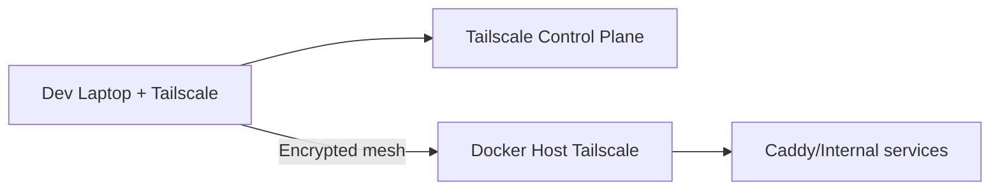

# Tailscale (VPN/Zero Trust nội bộ)

> Cập nhật tham chiếu: 2026-03-31 (đối chiếu tài liệu Tailscale container).

## 1) Tailscale trong `docker-compose.yml` hiện tại

- Image: `tailscale/tailscale:latest`.
- `network_mode: host`.
- `TS_AUTHKEY`, `TS_STATE_DIR`, `TS_USERSPACE=false`.
- Volume state: `tailscale_data:/var/lib/tailscale`.
- Mount `/dev/net/tun` + capabilities `NET_ADMIN`, `SYS_MODULE`.

## 2) Dịch vụ này hỗ trợ gì?

- Tạo private mesh VPN cho team/devops.
- Truy cập dịch vụ nội bộ bằng IP/hostname tailscale.
- ACL theo user/group/tag cho quyền truy cập theo nguyên tắc least-privilege.
- Có thể dùng làm đường quản trị thay vì public Internet.

## 3) Cấu hình quan trọng nên tối ưu

### 3.1 Auth key lifecycle

- Dùng auth key có thời hạn + scope phù hợp.
- Không hard-code trong repo.
- Rotate định kỳ.

### 3.2 Chế độ mạng

- `TS_USERSPACE=false` + `/dev/net/tun` cho hiệu năng tốt.
- Nếu môi trường không cho TUN, cân nhắc userspace networking.

### 3.3 ACL/Policy

- Chỉ cho nhóm SRE truy cập admin services.
- Tách tag (prod/staging/admin).

### 3.4 DNS nội bộ & MagicDNS

- Bật MagicDNS để truy cập dễ nhớ, thay IP.

### 3.5 Exit node/subnet routes (nếu cần)

- Có thể publish subnet route để truy cập mạng private khác.
- Cần kiểm soát chặt policy để tránh lateral movement.

## 4) Ứng dụng thực tế

- Team truy cập Portainer/Dozzle/Filebrowser chỉ qua VPN.
- SSH/RDP/HTTP nội bộ không mở public port.
- Kênh điều hành khẩn cấp khi Cloudflare gặp sự cố.

## 5) Diagram luồng hoạt động

## 6) Checklist production

- Pin image version.
- Không dùng authkey vĩnh viễn.
- ACL theo nhóm/tag.
- Audit device định kỳ.
- Bật MFA cho tài khoản tailscale admin.

## 7) Tài liệu tham khảo chính thức

- Tailscale Docker: https://tailscale.com/kb/1282/docker
- ACL policies: https://tailscale.com/kb/1018/acls
- MagicDNS: https://tailscale.com/kb/1081/magicdns
